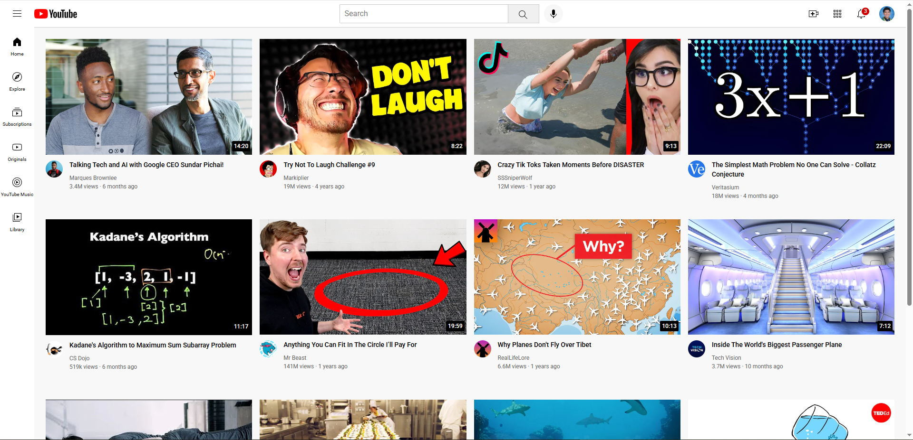

# 🎥 YouTube Clone (HTML & CSS)

This is a simple **YouTube-style webpage** built using only **HTML and CSS**.  
The project is inspired by YouTube’s layout and was created to practice frontend development and responsive web design.

## 🚀 Features
- 📺 YouTube-like homepage layout
- 🎨 Clean and responsive design
- 🔍 Search bar, video thumbnails, and sidebar navigation
- 📱 Mobile-friendly UI

## 🛠️ Tech Stack
- **HTML5**
- **CSS3**

## 🌐 Live Demo
👉 [View Website](https://pitchblack012.github.io/youtube-clone/)

## 📷 Preview

  

